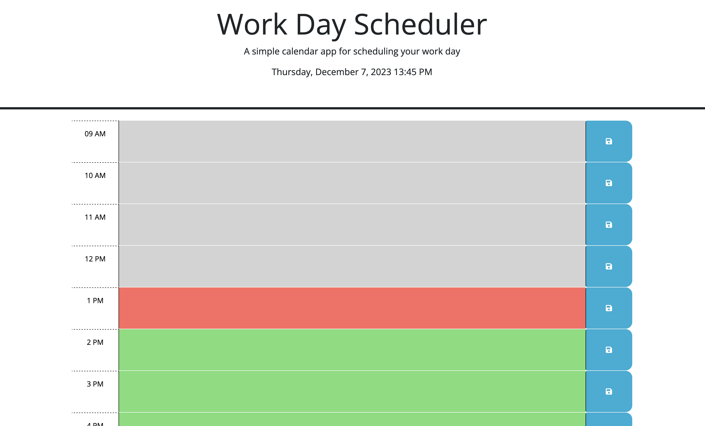

# Work Day Scheduler

## Building a Work Day Scheduler

The purpose of this project is to create a interactive work day scheduler. Developing this project demonstrates our programming skills using third party APIs.
This project was developed with javascript, jquery, and bootstrap. The code needed the use of local storage, arrays with objects, and demonstrate generating elements with javascript.  

The following is an image of the Web API Questionnaire.
 

## Installation

N/A

## Usage

To take the quiz, simply click the following link: https://gah-mewbittik.github.io/Wok-Day-Scheduler/
From there you will be able view the work day scheduler and simply click the space next to the displayed time period. Then enter the details you would like to save for that particular time period.  

## Credits

N/A

## License

Please refer to the LICENSE in the repo.